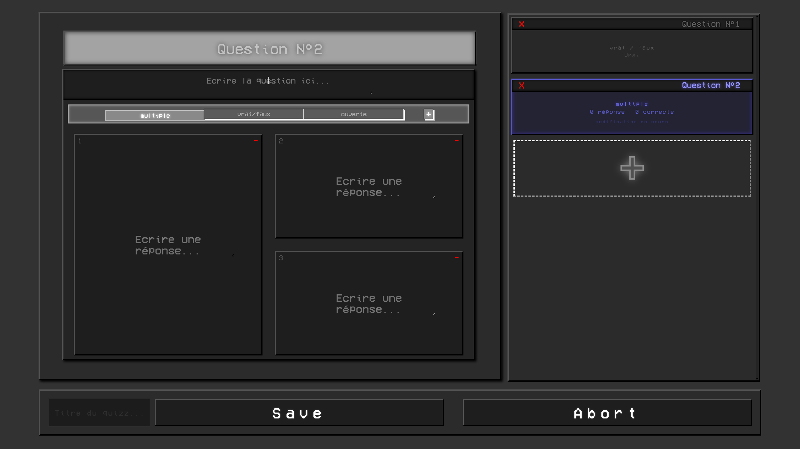
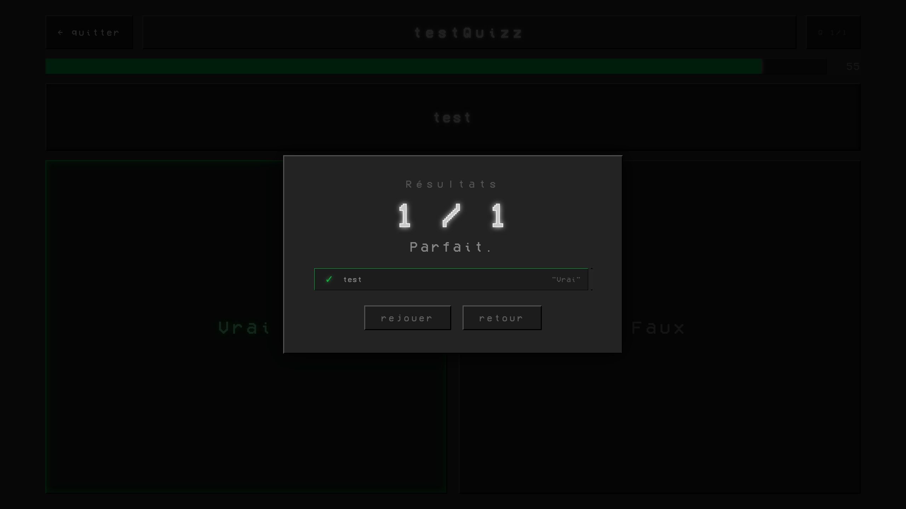
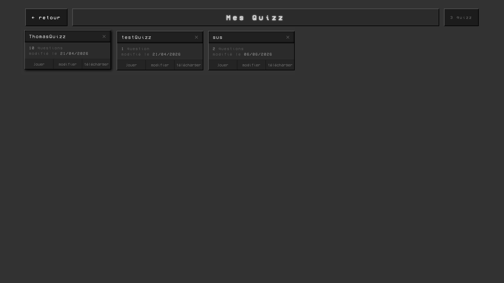
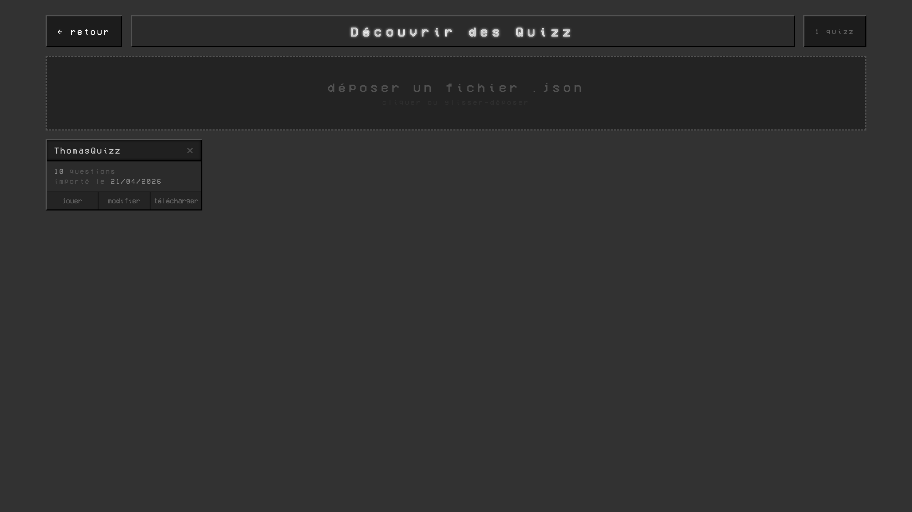

# Quizzap

> Une application quizz simple et efficace.

**Créateur de quizz · Gestionaire de quizz · Importeur de quizz · Joueur de quizz**  
Développé entièrement en HTML/CSS/JS - sans framework, sans moteur.

[▶ Essayer En ligne](https://skylepaf.github.io/Quizzap/web_browser/index.html)

*Les données seront enregistrer dans le local storage du navigateur.*

---

## Screenshots

| Createur de quizz | Joueur de quizz |
|---|---|
|  |  |

| Gestion de quizz | Importeur de quizz |
|---|---|
|  |  |

---

## Gameplay

You control circles on a grid full of squares. Goal: eat every harmless squares without dying to the slightly more harmfull ones.

- Move your character with the keyboard
- Sprint to outrun enemies
- Collect **powerups** to survive the chaos of later worlds
- Each world introduces new enemy behaviors and a different grids each different than another

---

## Contenu

- **Créateur de quizz** — 3 types de question possibles, simple d'utilisation et intuitif, enregistrement en 1 fichier à partager
- **Gestionnaire de quizz** — modification, suppression de quizz
- **Importeur de quizz** — possibilité d'importer un fichier quizz (.json)
- **Joueur de quizz** — jouer n'importe quel quizz avec un temp à parti et un score de fin

---

## Architecture

Aucuns moteurs. Aucunes frameworks. Entièrement conçu from scratch:

```
├── assets/
├── scenes/
│   ├── QuizzBrowser/
│   │   ├── index.js # lecture du ficher json importé et extraction des données
│   │   ├── QuizzBrowser.html # system d'affichage intelligent dynamique au nombre de quizz
│   │   └── style.css # style orignal dark et élégant
│   ├── QuizzCreator/
│   │   ├── index.js # sauvegarde dans un fichier json avec un ID et une structure définie
│   │   ├── QuizzCreator.html # structure en arbre :  div, footer, section -> autres divs -> ...
│   │   └── style.css # style orignal dark et élégant
│   ├── QuizzManager/
│   │   ├── index.js
│   │   ├── QuizzManager.html # system d'affichage intelligent dynamique au nombre de quizz
│   │   └── style.css # style orignal dark et élégant
│   └── QuizzPlayer/
│       ├── index.js # calcule de score complet
│       ├── QuizzPlayer.html # structure générique adapté à tout type de questions
│       └── style.css # style orignal dark et élégant 
├── index.html # menu principal menant vers toutes les fonctionnalités
└── styles.css # style orignal dark et élégant
```

L'HTML contient une structure simple et courte `<div>`, `<section>`... Les script gère le reste dynamiquement et les fichiers style ordonne la page.

Les quizz sont 100% gérés en fichiers de données — un quizz se construit de la forme:

```json
{
  "id": "1780757626080hrmhdw9tbn",
  "name": "quizz1",
  "createdAt": "2026-06-06T14:53:46.079Z",
  "modifiedAt": "2026-06-06T14:53:46.079Z",
  "questions": [
    {
      "text": "",
      "type": "multiple",
      "answers": [
        {
          "text": "",
          "isCorrect": true
        },
        {
          "text": "",
          "isCorrect": false
        },
        {
          "text": "",
          "isCorrect": false
        },
        {
          "text": "",
          "isCorrect": false
        }
      ],
    },
    {
      "text": "",
      "type": "vrai/faux",
      "answers": [
        {
          "text": "Vrai",
          "isCorrect": true
        },
        {
          "text": "Faux",
          "isCorrect": false
        }
      ],
    }
  ]
}
```

L'id est généré grace à une combinaison d'un nombre aléatoire et la date éxacte.
Pour la suite : 
- Createur de quizz = CQ
- Joueur de quizz = JQ
- Gestion de quizz = GQ
- Importeur de quizz = IQ

---

## A savoir

| Action | solution |
|--------|------|
| (Createur de quizz) selectionner la bonne réponse | *cliquer sur la case de la réponse* |
| (Createur de quizz) difficulté à enregistrer | *vérifié que tout les champs sont rempli et qu'au moins une réponse est définie comme correcte* |

---

## Stack

`HTML` `CSS` `JavaScript` — pas de dépendances, tourne dans n'importe quel navigateur.  

Packé en tant qu'application avec [Electron](https://www.electronjs.org/).  
Pour packer, aller dans `/web_app(Electron)` puis :  
```bash
npm install
npm run build
```
*L'éxecutable devrait se trouver dans /web_app(Electron)/dist/ .*
---

## Credits

Code, design and visuals by **SkylePaf**.
